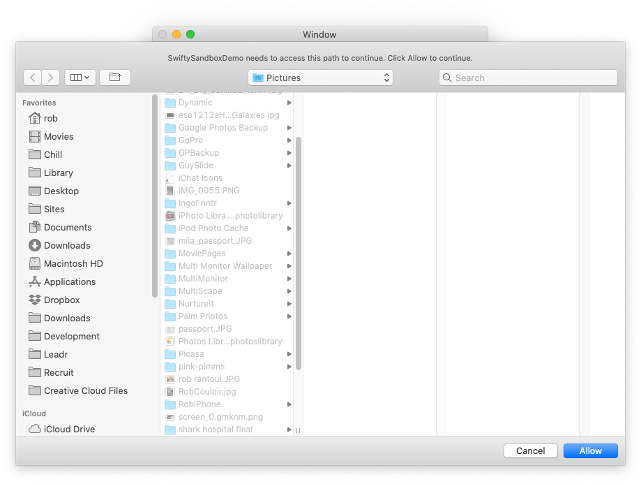

SwiftySandboxFileAccess
====================

This is a swift version of the original [AppSandboxFileAccess](https://github.com/leighmcculloch/AppSandboxFileAccess) with a simpler more swifty API and a handful of additional features.

Details
====================

A simple class that wraps up writing and accessing files outside a Mac apps App Sandbox files. The class will request permission from the user with a simple to understand dialog consistent with Apple's documentation and persist permissions across application runs using security bookmarks.

This is specifically useful for when you need to write files, or gain access to directories that are not already accessible to your application. 

When using this class, if the user needs to give permission to access the folder, the NSOpenPanel is used to request permission. Only the path or file requiring permission, or parent paths are selectable in the NSOpenPanel. The panel text, title and button are customisable.

How to Use
====================

### SwiftPackageManager

Standard drill!

### CocoaPods (deprecated - stuck on v 2!)

###  Entitlements:

In Xcode click on your project file, then the Capabilities tab. Turn on App Sandbox and change 'User Selected File' to 'Read/Write' or 'Read Only', whichever you need. In your project Xcode will have created a .entitlements file. Open this and you should see the below. If you plan on persisting permissions you'll need to add the third entitlement.

Main Function Groups
====================

Version 3.0 dramatically simplifies the API

All functions take a file URL

use  `SandboxFileAccess().someFunction`

### Save permission

`persistPermission(url:) -> Data?`

Saves a permission which the app has recieved in some other way (dropped on dock, file open, etc)

### Check whether you can access a file

`isAllowedToAccess(fileURL:URL) -> Bool`

Returns whether we can currently access the fileURL

### Access a file

	access(fileURL: URL,
	       askIfNecessary:Bool = true,
	       fromWindow:NSWindow? = nil,
             askIfNecessary:AskConditions = .ifBookmarkNotStored,
	       with block: @escaping SandboxFileSecurityScopeBlock)`

Use this block to asynchronously access your file.

NB: askIfNecessary will by default ask permission for any file where there isn't a stored bookmark - even if powerbox already grants access to the file. If you only care about access now, then you can use `.ifRequiredForReadonly` or `.ifRequiredForReadWrite`

License
====================

Copyright (c) 2013, Leigh McCulloch
and Rob Jonson
All rights reserved.

See included Licence file
